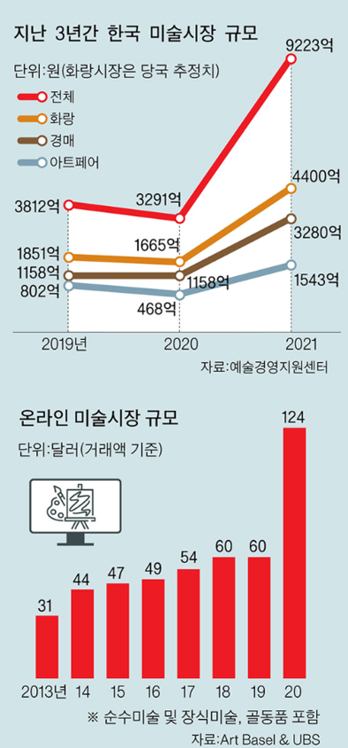
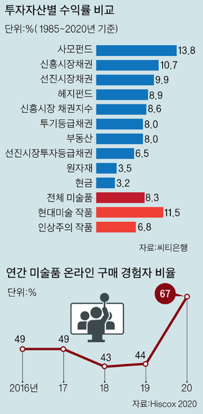
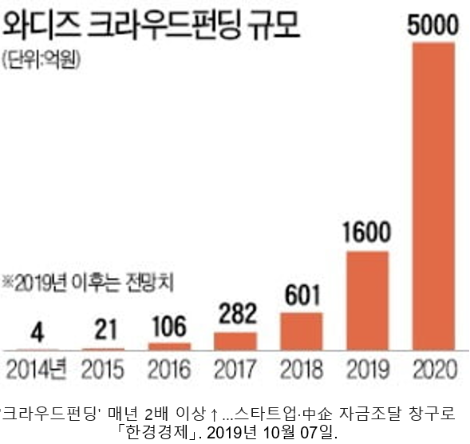
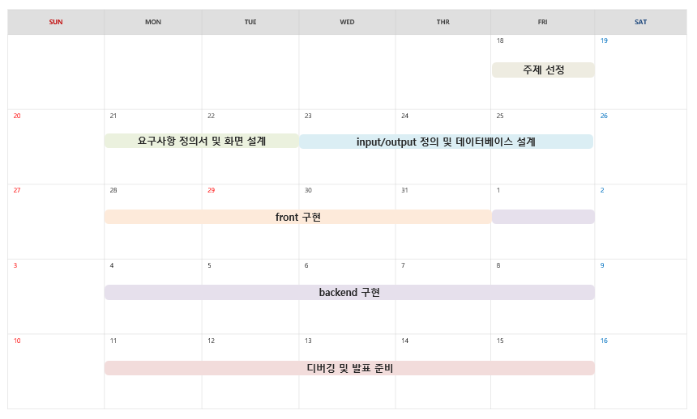

# 🏃‍♂ Aritsta 🏃‍♀

## Artista란 무엇일까?
- 독일어로 예술, 예술가를 의미
- 세련된 전시회 소개 사이트
- 작가들의 작품과 연혁을 소개 시켜주고 작품 판매까지 연결
- 자금이 부족해서 전시회를 갖지 못하는 작가들을 위한 펀딩 시스템
- 결과적으로 사람들에게 예술을 알리고 무명의 작가들에게 더 많은 기회를 제공

 

## 만들게 된 배경
- 한국의 예술시장의 규모가 급격하게 높아짐
- 미술품에 대한 펀드 및 투자 역시 급격하게 증가
- 젊은 작가들은 전시 비용이 없어 이름을 알릴 기회가 부족함
- 이처럼 예술에 대한 사람들의 관심이 높아지지만 관련 플랫폼 및 환경의 발전은 따라가지 못함
- 이러한 문제점들을 해결하기 위해서 프로젝트를 진행하게 

 

&ensp;&ensp;&ensp;&ensp;&ensp;
&ensp;&ensp;&ensp;&ensp;&ensp;
 

## 팀 역할

 

 <b>채효주</b> 

* 펀딩 리스트, 상세 페이지, 결제 설계 및 구현
* 아티스트 펀딩 등록 및 수정
* 펀딩 결제 API구현
* Load More 버튼 구현

 

 <b>홍성호</b> 

* 전체 페이지 디자인 설계
* 마이페이지 설계 및 구현
* 로그인, 회원가입 설계 및 구현
* 스토어, 장바구니, 결제 설계 및 구현
* 네이버, 구글 로그인 API사용
* 배송 조회 API사용
* 작품 결제 API사용
* AWS EC2 서버 배포
 

 

 <b>김상원</b> 

* 전체 페이지 디자인 설계
* 메인 페이지 설계 및 구현
* 전시 및 아티스트 페이지 설계 및 구현
* 슬라이드 구현
* 네비게이션 바 구현
* 아티스트 사진 랜덤 구현
 

 

 <b>조예선</b> 

* 아티스트 마이페이지 설계 및 구현
* 게시물 CRUD 페이징 구현
* 관리자 페이지 설계 및 구현
* 관리자 페이지 전시, 회원, 아티스트, 펀딩 목록 구현 및 상세보기
* 아티스트 페이지 작품, 펀딩, 전시 목록 구현 및 상세보기

 

## Demo

 

## 프로젝트 일정

 

## 기능

 <b>메인, 회원, 마이페이지, 관리자 페이지</b> 

 <b>메이트 구하기</b> 

 

 <b>오늘의 러닝</b> 

 <b>코스 공유</b> 

 <b>자유게시판</b> 

 

 

# 클래스 구조

 <b>메인페이지</b> 

 

 <b>멤버</b> 

 

 <b>자유게시판</b> 

 

 <b>오늘의러닝</b> 

 

 <b>메이트구하기</b> 

 

 <b>공통기능</b> 

 

 <b>코스공유</b> 

 

 

# 데이터베이스

 

# 기술스택

 <b>Back-end</b> 

* JAVA SE-11
* Spring Boot
* Spring MVC
* Tomcat

 

 <b>Front-end</b> 

* HTML5
* CSS
* JavaScript
* jQuery
* BootStrap5

 

 <b>DBMS</b> 

* MySQL

 

 <b>DevOps</b> 

* Git/GitHub
* Naver Works
* oven.app
* erdcloud
* googleSheet

 

 <b>API & Library</b> 

* API Docs - mapbox
* Kakao API - KakaoMap
* Ck Editor  
  

